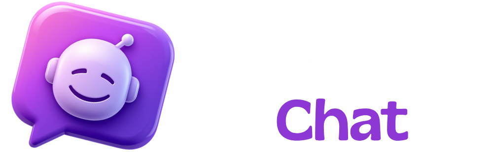
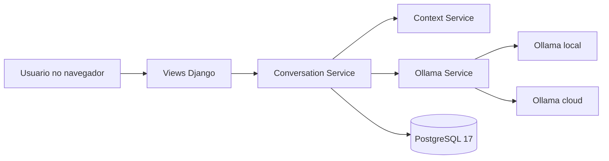
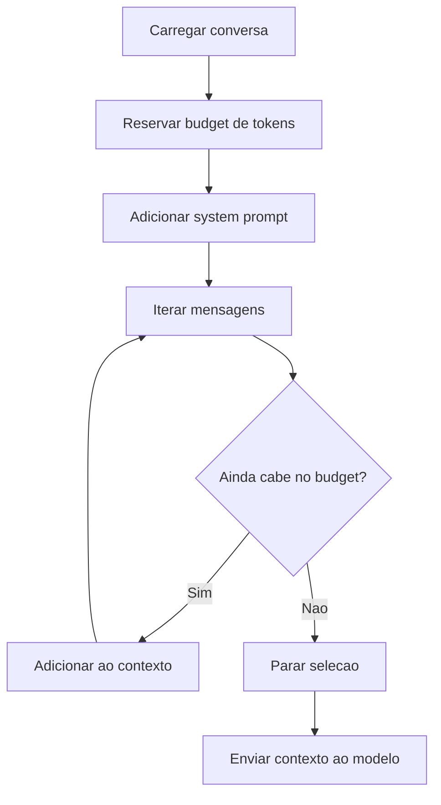
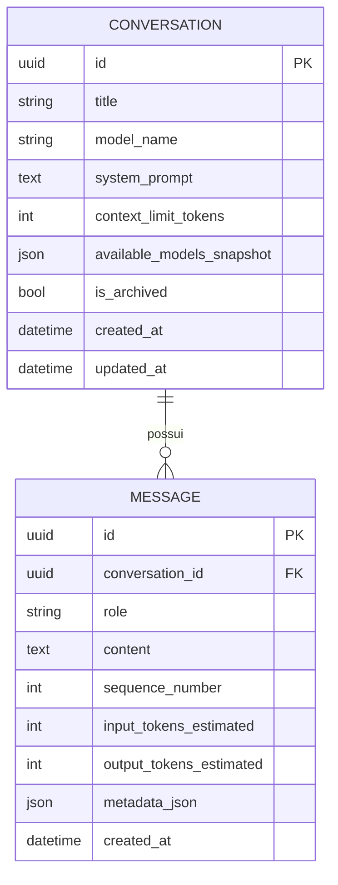
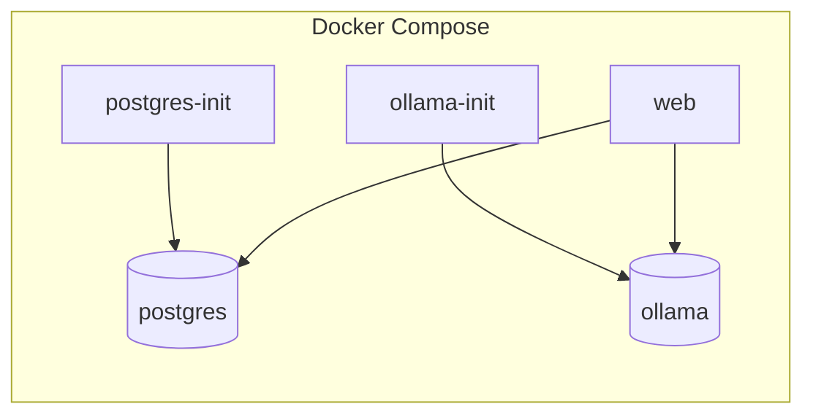

<p align="center">
  
</p>

# Claudinhos Chat

Desenvolvido por: [@ViniciusCN9](https://github.com/ViniciusCN9) e [@Guilherme-Zamboni](https://github.com/Guilherme-Zamboni)

O Claudinhos Chat e um chat cômico inspirado nos chatbots com IA atuais, mas com personalidade propria: ele responde perguntas gerais, preserva o historico das conversas e opera com um tom bem-humorado definido por prompt, usando colegas como referencia para analogias, piadas e parodias.

O projeto foi construido como uma aplicacao web em Django com persistencia em PostgreSQL e integracao com Ollama, permitindo usar um modelo local e um modelo em nuvem a partir da mesma interface. A ideia central e simples: conversar com uma IA em ambiente controlado, com contexto limitado por conversa, infra reproduzivel via Docker e codigo organizado em camadas claras.

## Visao Geral

- Interface web simples e responsiva para conversas com IA.
- Persistencia de conversas e mensagens com identificadores UUID.
- Suporte a dois perfis de execucao de modelo: local e cloud.
- Janela de contexto controlada por estimativa de tokens.
- Inicializacao completa da stack com Docker Compose.
- Endpoints HTTP para UI, listagem de modelos e health check.

## Identidade do Projeto

O comportamento padrao do assistente e orientado por um prompt de sistema com humor explicito. Em vez de tentar ser um chatbot neutro e corporativo, o Claudinhos Chat assume uma proposta mais descontraida, servindo como uma camada de experimentacao sobre os mesmos blocos que aparecem em chats modernos:

- interface conversacional
- armazenamento de historico
- escolha de modelo
- controle de contexto
- orquestracao de chamadas para LLM

Essa combinacao torna o projeto util tanto como demonstracao tecnica quanto como base para evolucoes futuras, como streaming de respostas, mais modelos e parametros por conversa.

## Stack Tecnologica

| Camada | Tecnologias |
| --- | --- |
| Backend | Python 3.13.9, Django 5 |
| Banco de dados | PostgreSQL 17 |
| Integracao com IA | Ollama local e Ollama cloud via HTTP |
| Frontend | HTML, CSS e JavaScript |
| Infraestrutura | Docker, Docker Compose |
| Bibliotecas principais | requests, python-dotenv, psycopg |

## Principais Funcionalidades

- Criacao de novas conversas com escolha de modelo.
- Envio da primeira mensagem ja na criacao do chat pela interface web.
- Listagem de conversas ordenadas por atividade recente.
- Persistencia completa do historico de mensagens.
- Montagem automatica do contexto ativo antes de chamar o modelo.
- Health check da integracao com provedores de modelos.
- Snapshot dos modelos disponiveis no momento da criacao da conversa.
- Fallback amigavel quando nenhum modelo estiver disponivel.

## Como a Aplicacao Funciona



Fluxo resumido:

1. O usuario abre a interface e escolhe um modelo.
2. A view recebe a mensagem e delega o fluxo para a camada de servico.
3. O Context Service seleciona apenas o historico que cabe no limite configurado.
4. O Ollama Service envia a requisicao ao provedor apropriado.
5. A resposta gerada e persistida como mensagem do assistente.
6. A interface renderiza o historico atualizado.

## Modelos de IA

O projeto trabalha com um catalogo simples de modelos, montado a partir das variaveis de ambiente:

- `OLLAMA_LOCAL_MODEL`: modelo executado localmente no servico Ollama. Padrao: `gemma3:1b`.
- `OLLAMA_CLOUD_MODEL`: alias para o modelo cloud. Padrao: `gemma4:31b-cloud`.
- `OLLAMA_DEFAULT_MODEL`: modelo preferencial da aplicacao.

No catalogo interno, cada modelo possui:

- nome interno
- rotulo exibido na UI
- tipo de execucao (`local` ou `cloud`)
- nome real enviado para a API (`api_model`)

Exemplo conceitual:

| Nome | Rotulo | Execucao | Uso |
| --- | --- | --- | --- |
| `gemma3:1b` | `Local` | local | roda no container Ollama |
| `gemma4:31b-cloud` | `Cloud` | cloud | usa endpoint cloud com API key |

### Comportamento atual

- Modelos locais podem ser aquecidos automaticamente com `keep_alive`.
- Modelos cloud exigem `OLLAMA_API_KEY` configurada.
- A troca de modelo apos iniciar uma conversa esta desabilitada na interface atual.
- Quando o provedor falha, a resposta do assistente registra indisponibilidade sem quebrar o fluxo da aplicacao.

## Controle de Contexto

O historico persistido e diferente do contexto ativo enviado ao modelo.

- Todo o historico fica salvo no banco.
- O contexto enviado ao LLM e recortado com base no limite de tokens da conversa.
- A estimativa atual usa a regra aproximada de 1 token a cada 4 caracteres normalizados.
- O `system_prompt` entra primeiro no contexto, se couber no orcamento.
- As mensagens mais recentes sao adicionadas de tras para frente ate o limite ser atingido.



## Estrutura do Banco de Dados

O schema principal gira em torno de duas entidades: `Conversation` e `Message`.



### Tabela `chat_conversation`

- Identifica cada chat por UUID.
- Armazena o titulo, modelo selecionado e prompt de sistema.
- Guarda o limite de contexto e um snapshot dos modelos disponiveis no momento da criacao.
- Mantem datas de criacao e atualizacao para ordenacao da interface.

### Tabela `chat_message`

- Armazena mensagens de `system`, `user` e `assistant`.
- Cada mensagem pertence a uma conversa.
- A ordenacao principal usa `sequence_number`.
- O campo `metadata_json` guarda informacoes auxiliares, como modelo usado e indisponibilidade.
- Existe restricao de unicidade por `(conversation_id, sequence_number)`.

## Infraestrutura com Docker

O ambiente conteinerizado sobe quatro servicos e dois volumes persistentes.



### Servicos

- `postgres`: banco PostgreSQL 17.
- `postgres-init`: executa o bootstrap SQL do schema inicial.
- `ollama`: servidor Ollama.
- `ollama-init`: faz pull e warm-up do modelo local.
- `web`: aplicacao Django.

### Volumes

- `postgres_data`: persistencia do banco.
- `ollama_data`: persistencia dos modelos do Ollama.

## Como Usar

### Opcao 1: via Docker Compose

Subir o ambiente:

```bash
docker compose build --no-cache web && docker compose up -d --force-recreate web
```

Parar o ambiente:

```bash
docker compose down
```

Depois disso, a aplicacao fica disponivel em `http://localhost:18080` por padrao.

### Opcao 2: execucao local sem Docker

1. Crie e ative um ambiente virtual Python.
2. Instale as dependencias.
3. Configure as variaveis de ambiente.
4. Garanta que PostgreSQL e Ollama estejam acessiveis.
5. Execute a aplicacao Django.

Exemplo:

```bash
pip install -r requirements.txt
python manage.py migrate
python manage.py runserver
```

## Variaveis de Ambiente Relevantes

| Variavel | Descricao | Padrao |
| --- | --- | --- |
| `DJANGO_SECRET_KEY` | chave da aplicacao Django | `key` |
| `DJANGO_DEBUG` | modo debug | `true` |
| `DJANGO_ALLOWED_HOSTS` | hosts aceitos | `127.0.0.1,localhost` |
| `DATABASE_URL` | string completa de conexao | vazio |
| `DATABASE_NAME` | nome do banco | `Claudinhos_chat` |
| `DATABASE_USER` | usuario do banco | `postgres` |
| `DATABASE_PASSWORD` | senha do banco | `postgres` |
| `DATABASE_HOST` | host do banco | `127.0.0.1` |
| `DATABASE_PORT` | porta do banco | `5432` |
| `OLLAMA_BASE_URL` | URL do Ollama local | `http://127.0.0.1:11434` |
| `OLLAMA_CLOUD_BASE_URL` | URL da API cloud | `https://ollama.com` |
| `OLLAMA_API_KEY` | chave para modelos cloud | vazio |
| `OLLAMA_LOCAL_MODEL` | modelo local principal | `gemma3:1b` |
| `OLLAMA_CLOUD_MODEL` | alias do modelo cloud | `gemma4:31b-cloud` |
| `OLLAMA_LOCAL_MODEL_KEEP_ALIVE` | tempo de aquecimento do modelo local | `15m` |
| `OLLAMA_TIMEOUT` | timeout das requisicoes | `60` |
| `CHAT_CONTEXT_LIMIT_TOKENS` | limite de contexto por conversa | `16384` |
| `CHAT_DEFAULT_SYSTEM_PROMPT` | personalidade base do assistente | prompt com humor |

### Exemplo de `.env`

```env
DJANGO_SECRET_KEY=dev-key
DJANGO_DEBUG=true
DJANGO_ALLOWED_HOSTS=127.0.0.1,localhost

DATABASE_NAME=Claudinhos_chat
DATABASE_USER=postgres
DATABASE_PASSWORD=postgres
DATABASE_HOST=127.0.0.1
DATABASE_PORT=5432

OLLAMA_BASE_URL=http://127.0.0.1:11434
OLLAMA_CLOUD_BASE_URL=https://ollama.com
OLLAMA_API_KEY=
OLLAMA_LOCAL_MODEL=gemma3:1b
OLLAMA_CLOUD_MODEL=gemma4:31b-cloud
OLLAMA_TIMEOUT=60
CHAT_CONTEXT_LIMIT_TOKENS=16384
```

## Endpoints Disponiveis

| Metodo | Rota | Finalidade |
| --- | --- | --- |
| `GET` | `/` | tela principal do chat |
| `GET` | `/conversations/` | lista conversas em JSON |
| `POST` | `/conversations/` | cria uma conversa |
| `GET` | `/conversations/<uuid>/` | detalha uma conversa |
| `POST` | `/conversations/<uuid>/messages/` | envia nova mensagem |
| `POST` | `/conversations/<uuid>/title/` | renomeacao, hoje desabilitada |
| `POST` | `/conversations/<uuid>/model/` | troca de modelo, hoje desabilitada |
| `GET` | `/models/` | lista modelos habilitados |
| `GET` | `/health/` | verifica saude da integracao |

## Estrutura do Projeto

```text
.
|-- Dockerfile
|-- docker-compose.yml
|-- manage.py
|-- requirements.txt
|-- script.sql
|-- assets/
|   |-- image/
|   `-- logo/
`-- src/
	|-- apps/
	|   `-- chat/
	|       |-- migrations/
	|       |-- services/
	|       |-- templates/chat/
	|       |-- tests/
	|       |-- forms.py
	|       |-- models.py
	|       |-- urls.py
	|       `-- views.py
	|-- config/
	|-- static/
	`-- templates/
```

### Divisao por camadas

#### 1. Apresentacao

- `src/templates/` e `src/apps/chat/templates/`: templates HTML.
- `src/static/`: CSS e JavaScript da interface.
- Responsavel por renderizacao, interacao do usuario e consumo dos endpoints.

#### 2. Controller

- `src/apps/chat/views.py`
- Recebe requisicoes HTTP, valida formularios, escolhe resposta HTML ou JSON e orquestra os services.

#### 3. Regras de negocio

- `src/apps/chat/services/conversation_service.py`
- `src/apps/chat/services/context_service.py`
- `src/apps/chat/services/ollama_service.py`
- Aqui ficam a criacao de conversas, envio de mensagens, selecao de contexto, validacao de modelo e integracao externa.

#### 4. Persistencia

- `src/apps/chat/models.py`
- Define entidades, relacoes, constraints e ordenacoes do dominio de chat.

#### 5. Configuracao da aplicacao

- `src/config/settings.py`
- `src/config/urls.py`
- `src/config/asgi.py`
- `src/config/wsgi.py`
- Centraliza variaveis de ambiente, rotas globais e bootstrap do Django.

#### 6. Infraestrutura de banco e containers

- `docker-compose.yml`, `Dockerfile` e `script.sql`
- Responsaveis por empacotamento, banco de dados, servicos auxiliares e reproducao do ambiente.

## Testes

O projeto ja possui uma base de testes para os services e para as views do chat. Para rodar a suite com configuracao de teste:

```bash
python manage.py test --settings=config.test_settings
```

Nessa configuracao, o projeto usa SQLite em arquivo local para simplificar a execucao dos testes.

## Diferenciais Tecnicos

- Uso de UUID nas entidades principais.
- Catalogo de modelos centralizado em configuracao.
- Distincao clara entre historico persistido e contexto ativo.
- Suporte a indisponibilidade do LLM com mensagem amigavel.
- Bootstrap SQL para subir o banco rapidamente em ambiente Docker.
- Estrutura pronta para evoluir para streaming e mais provedores.

## Limitacoes Atuais

- A interface nao permite trocar o modelo depois do inicio da conversa.
- A renomeacao de chats esta desabilitada na UI.
- O controle de contexto usa estimativa simples de tokens, nao tokenizacao real do modelo.
- A interface ainda nao implementa streaming de resposta.

## Evolucoes Naturais

- Streaming de tokens na interface.
- Parametros por conversa, como temperatura e top_p.
- Resumo de historico antigo para aumentar a janela efetiva de contexto.
- Exportacao de conversas.
- Renderizacao de Markdown nas respostas do assistente.

## Resumo

O Claudinhos Chat combina humor, arquitetura limpa e uma stack moderna para demonstrar como construir um chatbot web com Django, PostgreSQL e Ollama. O resultado e um projeto didatico, funcional e pronto para extensoes, mantendo a separacao entre interface, regras de negocio, persistencia e infraestrutura.